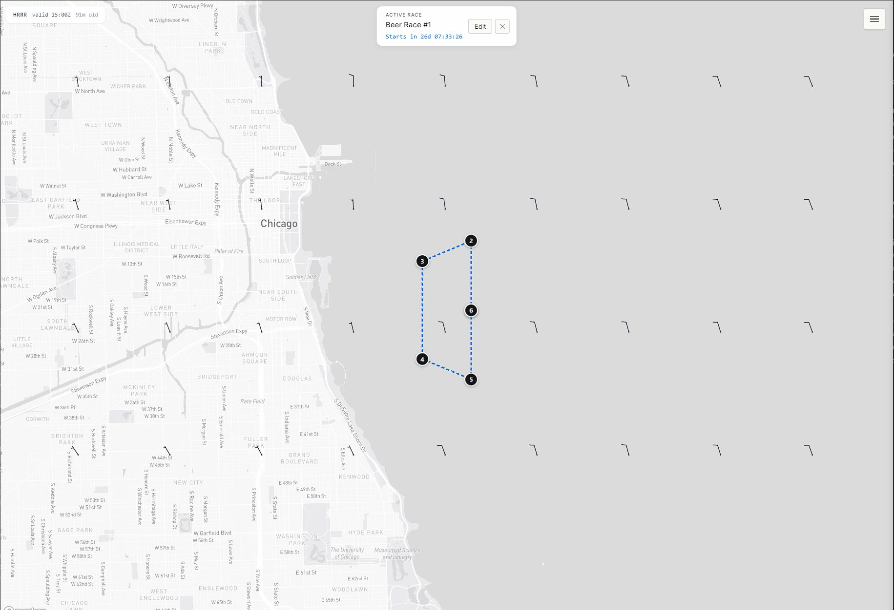
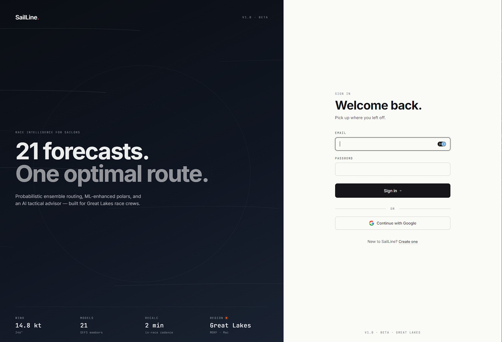
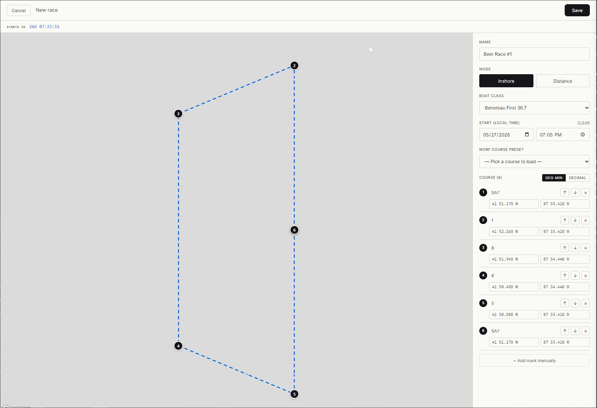
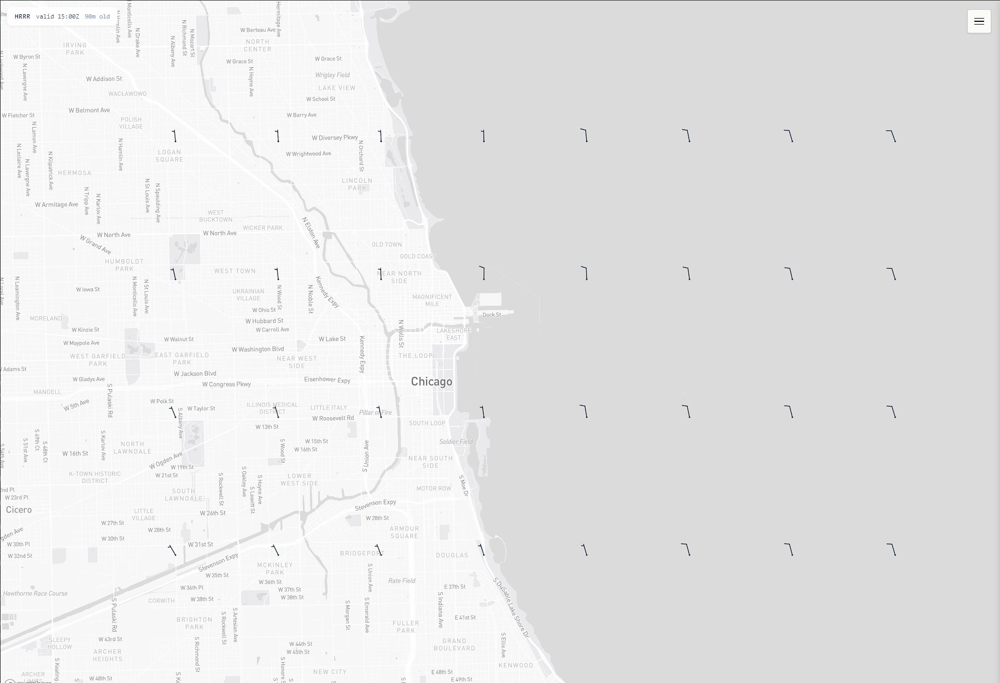

# SailLine

Race routing for sailors on the Great Lakes. Plan a course, watch the wind, run the start clock.

**Status:** Live in pre-launch at [sailline.web.app](https://sailline.web.app) · Targeting v1 for the 2026 Chicago–Mac season



---

## What it does today

SailLine is a map-first sailing app. The current cut handles everything you need to walk into a Saturday club race:

- **HRRR wind barbs** rendered live across the Great Lakes, refreshed every model cycle (~hourly), with adaptive density that stays readable from regional zoom down to a 4-nautical-mile course.
- **Course editor** with 64 baked-in MORF buoy course presets (T/O/P/C/W/X/Y/S families), 24 named MORF marks with race-book descriptions, click-to-drop new marks, drag-to-move, and lat/lon entry in either decimal or deg-decimal-min.
- **Race start time + live countdown.** Set local date and time; the countdown ticks every second in the editor banner and on the map overlay once the race is active.
- **Map = single pane of glass.** Save a race, land back on the map with the course drawn over the wind and a top-center overlay showing the race name and countdown. The active race persists across reloads and clears itself 6 hours past start.

It's deployed end-to-end. Email + Google sign-in, courses persist in Cloud SQL, frontend on Firebase Hosting, API on Cloud Run.

### Where it's headed

The longer roadmap — isochrone routing, AIS competitor tracking, an AI tactical advisor powered by Claude, GPS track recording, polar-driven boat speed, and a hardware tier with Pi telemetry — is what makes this more than a wind viewer. Those are real features in the PRD, not shipped yet. See [Roadmap](#roadmap).

### Boat classes

Beneteau First 36.7 · J/105 · J/109 · J/111 · Farr 40 · Beneteau First 40.7 · Tartan 10 · Generic PHRF/ORC

### More views

Sign-in is split-screen with a tagline that points at the longer roadmap (probabilistic ensemble routing, ML-enhanced polars, AI advisor) — what's shipped today is the foundation those features will build on.



The race editor is map-first: pick a MORF preset or drop marks by clicking; type lat/lon directly; set a local-time start to drive the countdown. The countdown banner under the top-bar ticks every second once a start is set.



The map view by itself shows HRRR wind barbs at adaptive density — denser at higher zoom (interpolated between native ~11km grid points), sparser at lower zoom (decimated from native).



---

## Tech stack

| Layer | Technology |
|---|---|
| Frontend | React + Vite, Mapbox GL, Firebase Auth |
| Backend | FastAPI (Python 3.12), asyncpg |
| Database | Cloud SQL (PostgreSQL + PostGIS), Alembic migrations |
| Cache | Memorystore for Redis (weather payloads) |
| Hosting | Cloud Run (API), Firebase Hosting (frontend) |
| Storage | Cloud Storage (GRIB2 archive) |
| Background jobs | Cloud Run Jobs (NOAA ingest), Cloud Scheduler |
| Weather data | NOAA HRRR + GFS via cfgrib |
| CI/CD | Cloud Build (auto-deploy on push to `main`) |

Planned additions for full v1: Datalastic (AIS), Anthropic Claude API (advisor), Stripe (Pro tier).

---

## Project structure

```
sailline/
├── backend/
│   ├── app/
│   │   ├── main.py
│   │   ├── auth.py              # Firebase JWT verification
│   │   ├── db.py                # asyncpg pool over Cloud SQL Connector
│   │   ├── config.py
│   │   ├── routers/             # health, users, weather, races
│   │   ├── services/            # GRIB parser
│   │   └── models/
│   ├── workers/
│   │   └── weather_ingest.py    # Cloud Run Job: NOAA → Redis + GCS
│   ├── migrations/              # Alembic
│   │   └── versions/
│   ├── tests/                   # pytest, mocked asyncpg pool
│   ├── Dockerfile
│   └── requirements.txt
├── frontend/
│   ├── src/
│   │   ├── components/          # MapView
│   │   ├── hooks/               # useWeather, useGeolocation, useCountdown, useRaces
│   │   ├── lib/                 # latlon parsing, MORF marks/courses, wind barb generator
│   │   ├── AppView.jsx          # post-login shell
│   │   ├── AuthView.jsx         # split-screen login
│   │   ├── RaceEditor.jsx       # full-screen course editor
│   │   └── RacesListView.jsx
│   ├── firebase.json
│   └── package.json
├── infra/
│   ├── schema.sql               # one-time bootstrap (PostGIS + grants + ownership)
│   ├── cloudbuild.yaml          # backend deploy pipeline
│   └── cloudbuild.frontend.yaml # frontend deploy pipeline
└── docs/
    ├── prd.md                   # product requirements
    ├── architecture.md          # GCP architecture
    ├── migrations.md            # Alembic workflow + troubleshooting
    └── 2026-*-*.md              # session summaries (chronological build log)
```

---

## Local development

### Prerequisites

- Python 3.12+
- Node.js 20+
- `gcloud` CLI authenticated to a GCP project (or a local Postgres for offline dev)
- A Mapbox access token (free tier is fine)
- A Firebase project with Email/Password + Google sign-in enabled

### Backend

```bash
cd backend
python -m venv .venv
source .venv/bin/activate         # PowerShell: .\.venv\Scripts\Activate.ps1
pip install -r requirements.txt

cp .env.example .env              # then fill in CLOUD_SQL_INSTANCE, DB_USER/PASSWORD/NAME, REDIS_HOST

# One-time DB bootstrap (PostGIS + grants + ownership). Run as postgres superuser:
psql -h 127.0.0.1 -U postgres -d sailline_app -f ../infra/schema.sql

# Apply schema migrations as the app user:
alembic upgrade head
alembic current

# Run the API
uvicorn app.main:app --reload --port 8080
```

API docs at `http://localhost:8080/docs`.

To run the test suite:

```bash
python -m pytest tests/ -v
```

(`python -m pytest` rather than plain `pytest` so the `app` package is importable. Or add `pythonpath = .` to `pytest.ini`.)

### Frontend

```bash
cd frontend
npm install
cp .env.example .env.local        # add VITE_MAPBOX_TOKEN + VITE_FIREBASE_*
npm run dev
```

Frontend runs at `http://localhost:5173`. In development, set `VITE_API_URL=http://localhost:8080` in `.env.local` to point at your local backend; production leaves it empty and uses Firebase Hosting rewrites for same-origin requests.

---

## Deployment

Cloud Build triggers run on every push to `main`:

- **Backend** (`infra/cloudbuild.yaml`) — builds the image, pushes to Artifact Registry, deploys a new Cloud Run revision.
- **Frontend** (`infra/cloudbuild.frontend.yaml`) — `npm ci && npm run build && firebase deploy --only hosting`. Materializes `.env.production` from the `sailline-frontend-env` secret at build time so Vite can bake env vars into the bundle.

**Migrations are manual** by design. A failed migration mid-deploy is messier than a known-state hand-applied one; the runbook is in [`docs/migrations.md`](./docs/migrations.md). Short version: apply the migration *before* pushing for additive changes, split into two commits for destructive changes.

Weather worker runs on Cloud Scheduler:

- `weather-hrrr` — hourly
- `weather-gfs` — every 6 hours

Both write to Redis (current cycle) with GCS as a fallback / archive.

---

## Environment variables

### Backend

```
GCP_PROJECT_ID
CLOUD_SQL_INSTANCE          # project:region:instance
DB_USER
DB_PASSWORD                 # injected from Secret Manager in prod
DB_NAME
REDIS_HOST                  # Memorystore private IP
REDIS_PORT
GCS_WEATHER_BUCKET
```

Future (when those features ship): `DATALASTIC_API_KEY`, `ANTHROPIC_API_KEY`, `STRIPE_SECRET_KEY`, `STRIPE_WEBHOOK_SECRET`.

### Frontend

```
VITE_API_URL                # empty in prod (uses Firebase Hosting rewrites); http://localhost:8080 in dev
VITE_MAPBOX_TOKEN
VITE_FIREBASE_API_KEY
VITE_FIREBASE_AUTH_DOMAIN
VITE_FIREBASE_PROJECT_ID
VITE_FIREBASE_STORAGE_BUCKET
VITE_FIREBASE_MESSAGING_SENDER_ID
VITE_FIREBASE_APP_ID
```

Production secrets live in GCP Secret Manager. The frontend bundle holds public Firebase config + Mapbox token; both are usage-restricted to the production domain.

---

## Roadmap

**Shipped (this is what you can use today)**
- Firebase Auth (email + Google), tier gating wired in (free / pro / hardware)
- HRRR wind barbs with adaptive density; GFS available server-side
- Race CRUD, MORF mark library, 64 buoy course presets, deg-min/decimal coordinate entry
- Race start time + live countdown; active-race persistence with grace window

**Next (week 6+, in rough order)**
- GPS track recording (table exists, no UI yet)
- Isochrone routing engine + boat polars
- AI tactical advisor (Claude API)
- AIS competitor tracking (Datalastic)
- Stripe checkout + Pro tier gating on routing endpoints

**Later (v1.5 / v2)**
- Long-distance course presets (Zimmer, Skipper's Club, Hammond)
- Probabilistic ensemble routing (GEFS), wave data
- Tablet / cockpit layout
- Post-race AI analysis
- Pi telemetry hardware tier
- ML-learned polars + custom polar uploads

The full PRD is in [`docs/prd.md`](./docs/prd.md). Per-session build notes (decisions, dead-ends, fixes) live in `docs/YYYY-MM-DD-*.md` files — useful as a build log if you're poking around the history.

---

## Documentation

- [Product Requirements](./docs/prd.md)
- [Technical Architecture](./docs/architecture.md)
- [Migration Workflow](./docs/migrations.md)
- Session build log — `docs/2026-04-28-session-summary.md` onward

---

## License

GPL-2.0. See [LICENSE](./LICENSE).
